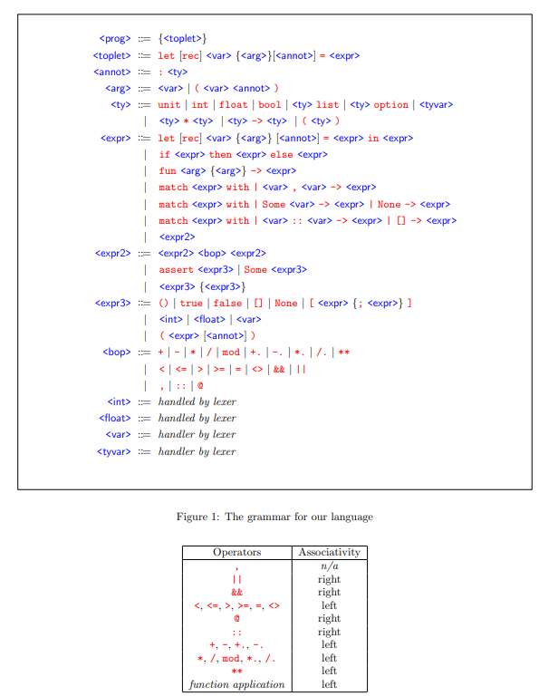

# DSL OCaml Interpreter

This project implements a mini-OCaml interpreter with static type checking and type inference capabilities. The interpreter analyzes and evaluates OCaml programs, performing type checking, type inference (based on Hindley-Milner algorithm), and program evaluation.



## Features

- **Static Type Checking**: Validates program types before execution
- **Type Inference**: Automatically deduces types using the Hindley-Milner algorithm
- **Program Evaluation**: Executes valid OCaml programs
- **Support for Common OCaml Types**:
  - Basic types: `int`, `float`, `bool`, `unit`
  - Compound types: `list`, `option`, pairs
  - Function types with proper type checking
- **Language Constructs**:
  - Let bindings (including recursive definitions)
  - Functions and function application
  - Pattern matching on lists, options, and pairs
  - Conditionals and assertions
  - Built-in operators for arithmetic, comparison, and more

## Project Structure

- [`bin`](bin): Contains the main executable entry point
- [`lib`](lib): The core interpreter implementation
  - [`lib/parser`](lib/parser): Lexer and parser for OCaml syntax
  - [`lib/utils`](lib/utils): Utility functions and type definitions
- [`test`](test): Test suite for the interpreter

## Usage

To run the interpreter on a file:

```bash
dune exec interp03 -- yourfile.ml